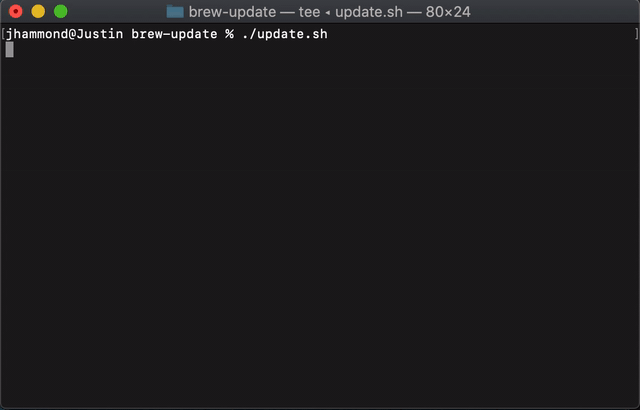

<div align="center">

# Brew Update

Automate the entire Homebrew update process with just one command.

[](https://travis-ci.com/Justintime50/brew-update)
[](LICENSE)



</div>

Brew Update automates the entire Homebrew update process including updating available taps and formulas, upgrading packages, upgrading cask packages, cleaning up old/stale taps and formulas, and checking for problems with your Homebrew instance. The script saves the output to a log file on each run found at `~/brew-update`.

## Install

```bash
# Setup the tap
brew tap justintime50/formulas

# Install the tool
brew install brew_update
```

## Usage

```bash
brew-update
```

### Cron

Ensure your path is accessible via the cron.

```bash
crontab -e

0 1 * * * brew-update
```
